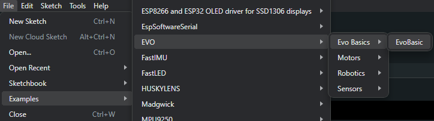
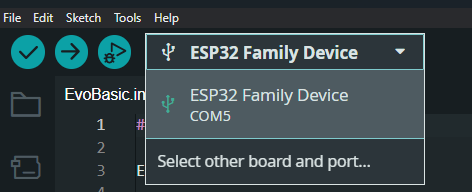
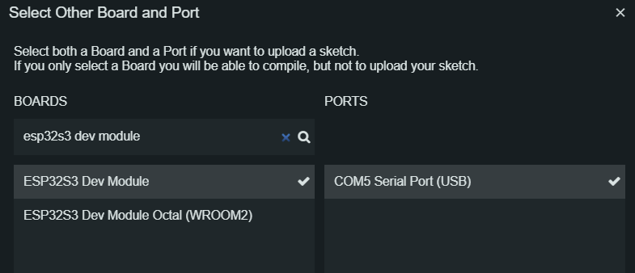
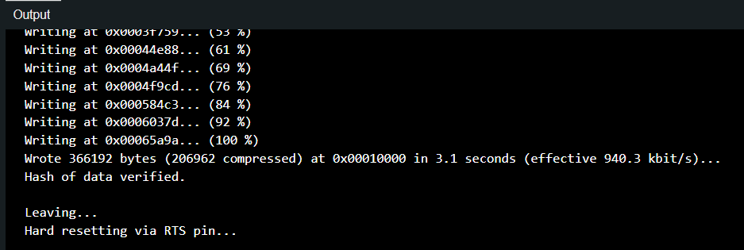

Downloading your first program
===============================

.. _Opening Example Code:

Opening Example Code
---------------------

The EVO library comes with example code that you can use to help you get started on using the features of the EVO. Click on File -> Examples -> EVO -> EvoBasics -> EvoBasic

.. raw:: html

     

.. _Downloading to EVOX1:

Downloading to EVOX1
-----------------------

To download the program into the EVOX1, the port and correct boards needs to be correctly selected. 

1. Connect the EVOX1 to the computer and turn it on. A new port will appear in the drop down on the top left corner.

.. raw:: html

     

2. Click on Select other board and port.

3. Search for ESP32S3 Dev Module and make sure that the correct COM port is selected.

.. raw:: html

     

4. Click on the upload button on the top left corner to upload your program. The first compile and upload for each Arduino sketch will take the longest. Subsequent compilation will be faster as the compiler uses the already compiled libraries for upload. When upload is complete you should see the following.

.. raw:: html

     