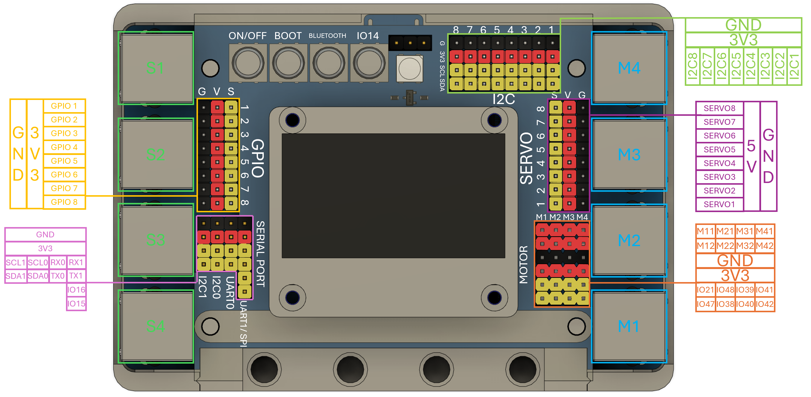

Hardware Overview
=======================

The EVOX1 is a 3.3V logic microcontroller. Sensors will need to be 3.3V compaitable for correct operation. Although the device is a 3.3V logic microcontroller, it had a 5V rail on the Servo ports to provide sufficient power to the servoc connected. 

The EVOX1 boasts the following features:

* Bluetooth Classic via inbuilt HC-05
* Bluetooth Low Energy 5.0
* Integrated Wi-Fi 4 (802.11b/g/n, 2.4GHz) 
* EV3 Motor ports x 4 
* Motor ports with encoder x 4 (shared with EV3 Motor ports)
* Servo Ports x 8
* I2C multiplexed ports x 8
* EV3 Sensor ports x 4
* GPIO ports x 8 (shared with EV3 Sensor ports)
* UART/ SPI hybrid port x 2
* I2C port x 2

.. _Pinouts:

Pinouts
------------

.. _Connecting Hardware:

Connecting Hardware
----------------------

The pins on the EVOX1 are color coded. Do exercise caution when connecting any hardware to the ports.

.. list-table:: Wire Color Codes
   :header-rows: 1
   :align: center

   * - Color
     - Pin
   * - Black
     - Ground
   * - Red
     - Power
   * - Yellow
     - Data
