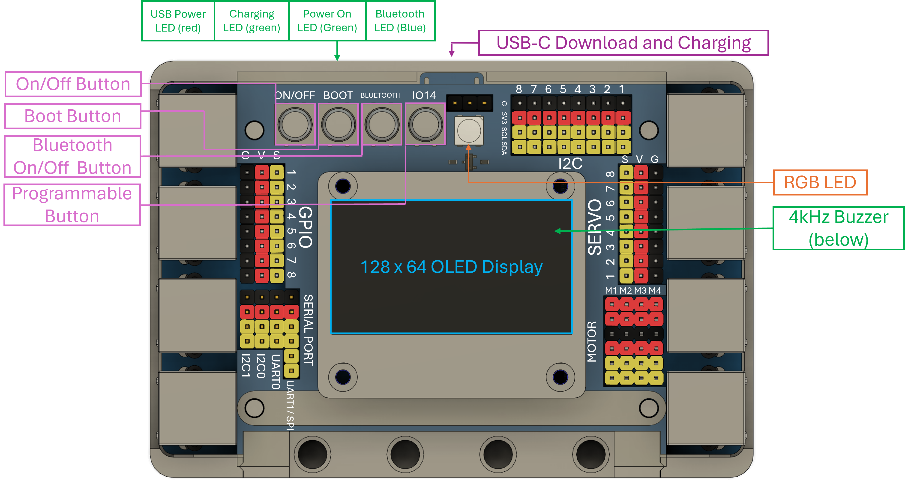

Hardware Overview
=======================

The EVOX1 is a 3.3V logic microcontroller. Sensors will need to be 3.3V compaitable for correct operation. Although the device is a 3.3V logic microcontroller, it has a 5V rail on the servo ports to provide sufficient power to the servos connected. 

.. _Hardware Features:

Hardware Features
------------------

The EVOX1 boasts the following features:

* **Ports**

    * EV3 Motor ports x 4 
    * Motor ports with encoder x 4 (shared pins with EV3 Motor ports)
    * Servo Ports x 8
    * I2C multiplexed ports x 8
    * EV3 Sensor ports x 4
    * GPIO ports x 8 (shared pins with EV3 Sensor ports)
    * UART/ SPI hybrid port x 2
    * I2C port x 2

* **Peripherals**

    * 4kHz Buzzer
    * 128 x 64 1.54 inch OLED display
    * Programmable button
    * RGB LED indicator (shared pins with programmable button)

* **Wireless Functionalities**

    * Bluetooth Classic via inbuilt HC-05
    * Bluetooth Low Energy 5.0
    * Integrated Wi-Fi 4 (802.11b/g/n, 2.4GHz) 

.. _Pherperials:

Pherperials
------------

.. raw:: html

     

.. list-table:: Pherperials
   :header-rows: 1
   :align: center

   * - Pherperial
     - Description
   * - On/Off Button 
     - .. line-block:: 
        On momentary press: turns the EVOX1 on  
        On long press: turns off the EVOX1
   * - Boot Button
     - .. line-block::
        On momentary press: puts the EVOX1 into normal mode  
        On long press: puts the EVOX1 into bootloader mode
   * - Bluetooth On/Off Button 
     - .. line-block::
        On momentary press: turns the Bluetooth on
        On long press: turns off the Bluetooth
   * - Programmable Button 
     - .. line-block::
        Button that can be programmed 
        Must be used as INPUT_PULLUP
        Connected to the same IO14 as the RGB LED
   * - USB Power LED (red)
     - Indicates power going into the EVOX1 from the USB-C port
   * - Charging LED (green)
     - .. line-block::
        Steady: Charging  
        Blinking: Unable to charge
        Off: Battery is full
   * - Power On LED (green)
     - Indicates that the EVOX1 is on
   * - BLuetooth LED (blue)
     - .. line-block::
        Blink once in 2 seconds: Bluetooth in command mode / Connected
        Repeated Blinking: Waiting for connection / Disconnected
        Off: Bluetooth is off
   * - USB-C Download and Charging        
     - Download and charging port
   * - RGB LED
     - .. line-block::
        WS2812 RGB LED
        Connected to the same IO14 as the programable button
   * - 4kHz Buzzer        
     - Programmable buzzer 

.. _Pinouts:

Pinouts
------------

.. image:: ../pictures/EVOX1pinout.png
    :align: center

.. raw:: html

     

.. _Connecting Hardware:

Connecting Hardware
----------------------

The pins on the EVOX1 are color coded. Exercise caution when connecting any hardware to the ports.

.. list-table:: Wire Color Codes
   :header-rows: 1
   :align: center

   * - Color
     - Pin
   * - Black
     - Ground
   * - Red
     - Power
   * - Yellow
     - Data
