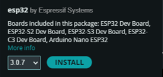
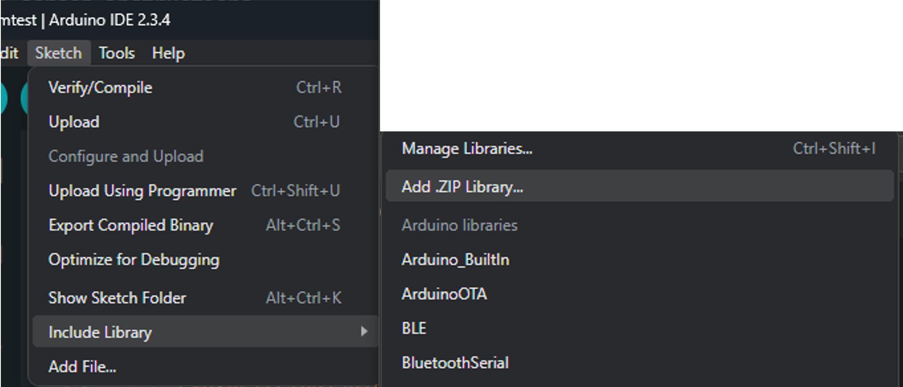
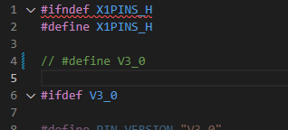

Programming with ArduinoIDE
===========================

.. _ArduinoIDE 2.x Installation:

ArduinoIDE 2.x Installation
----------------------------

1. Go to the official Arduino IDE download page: https://www.arduino.cc/en/software

2. Download the version for your operating system:

 * Windows: .exe installer or .zip (portable version)
 * Mac: .dmg installer
 * Linux: .AppImage or package for your distribution

3. Install Arduino IDE by following the on-screen instructions.

.. _EVO Board Installation:

EVO Board Installation
----------------------

1. Click on the Boards Manager on the left.

2. Search for esp32.

3. Install the board **esp32 by Espressif Systems**

.. raw:: html

     

.. _EVO Library Installation:

EVO Library Installation
-------------------------
1. Go to to the EVO github and navigate to the releases page (https://github.com/ljk1331ljk/EVO-arduino/releases).

2. Download the Source code (zip) under Assets from the latest release.

3. In ArduinoIDE, click on Sketch -> Include Library -> Add .ZIP Library and select the file just downloaded.

.. raw:: html

     

4. There are other dependencies that needs to be manually installed currently. Search for the following libraries under the library manager and install them. This list of libraries can increase over time. Do check this section from time to time when there are new releases available.

 * Adafruit NeoPixel by Adafruit
 * Adafruit PWM Servo Driver Library by Adafruit
 * EspSoftwareSerial by Dirk Kaar, Peter Lerup
 * ESP32Encoder by Kevin Harrington
 * Adafruit VL53L0X by Adafruit
 * Adafruit TCS34725 by Adafruit

.. _Updating EVO Library:

Updating EVO Library
----------------------

To update the EVO library when there is a new relsease available repeat the steps in :ref:`EVO Library Installation` and the library will be overwritten.

.. _Using V2.0 Hardware:

Using V2.0 Hardware
--------------------

If you are using V2.0 hardware. you need to perform the following steps to edit your library. 

1. Go to you Arduino library folder. If it has not been changed, it will be at Documents/Arduino/libraries.

2. Go to EVO/src/helper and open the X1pins.h file.

3. Comment out line 4 and save the changes.

.. raw:: html

     

4. To verify which version of pin configuration you are using, you can display PIN_VERSION on the serial monitor or on the display.

5. To revert to using V3.0 pin configuration, uncomment line 4 and save the changes.
